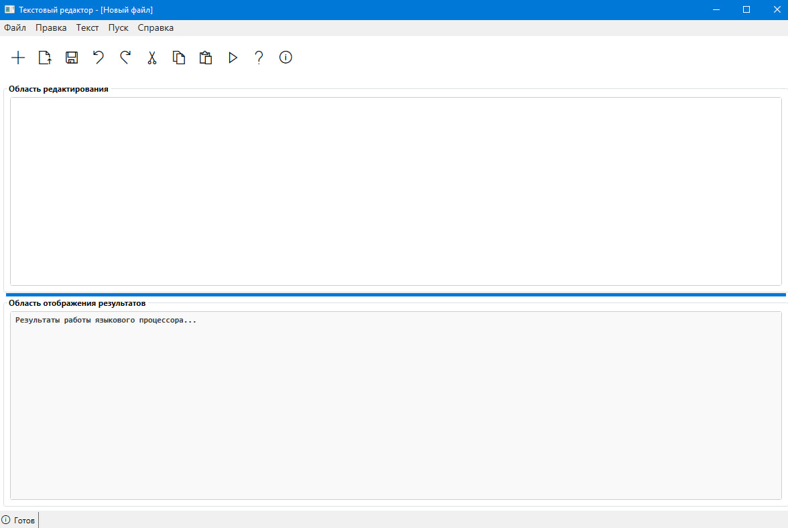
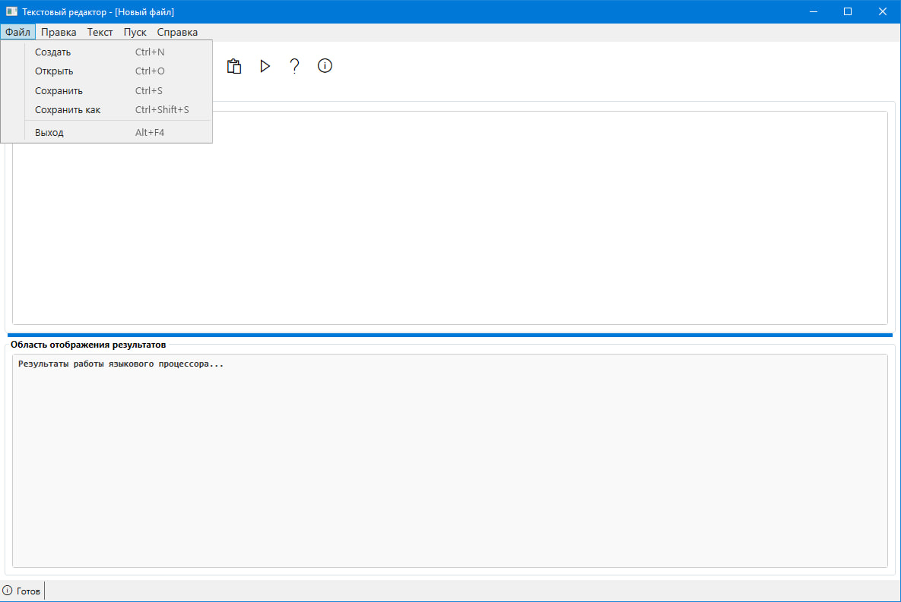
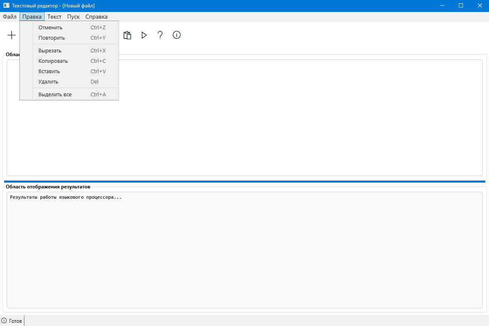
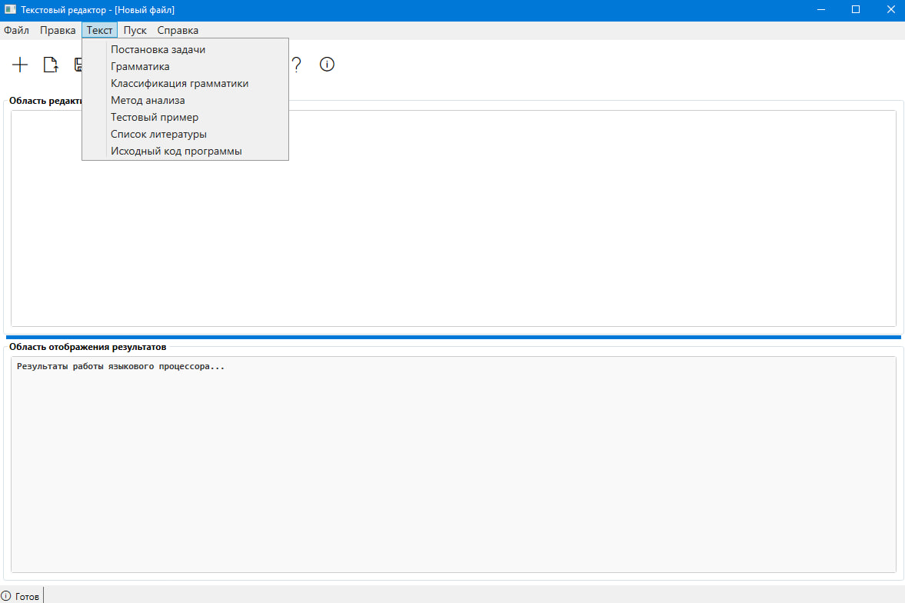
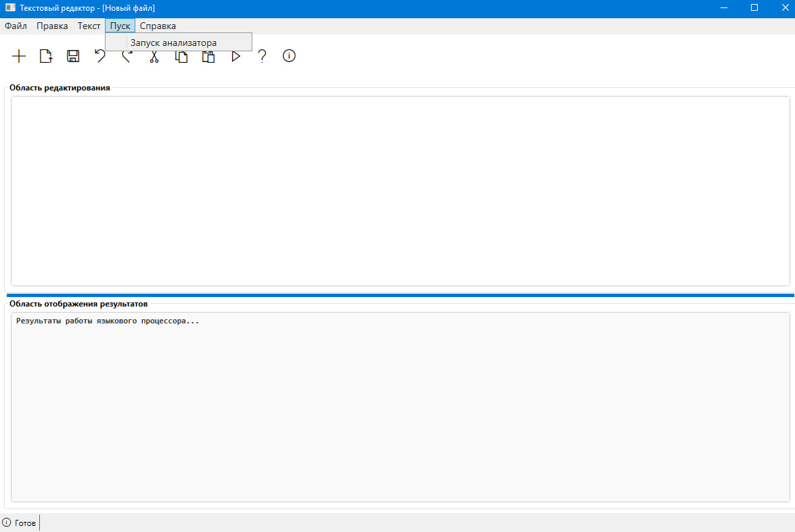
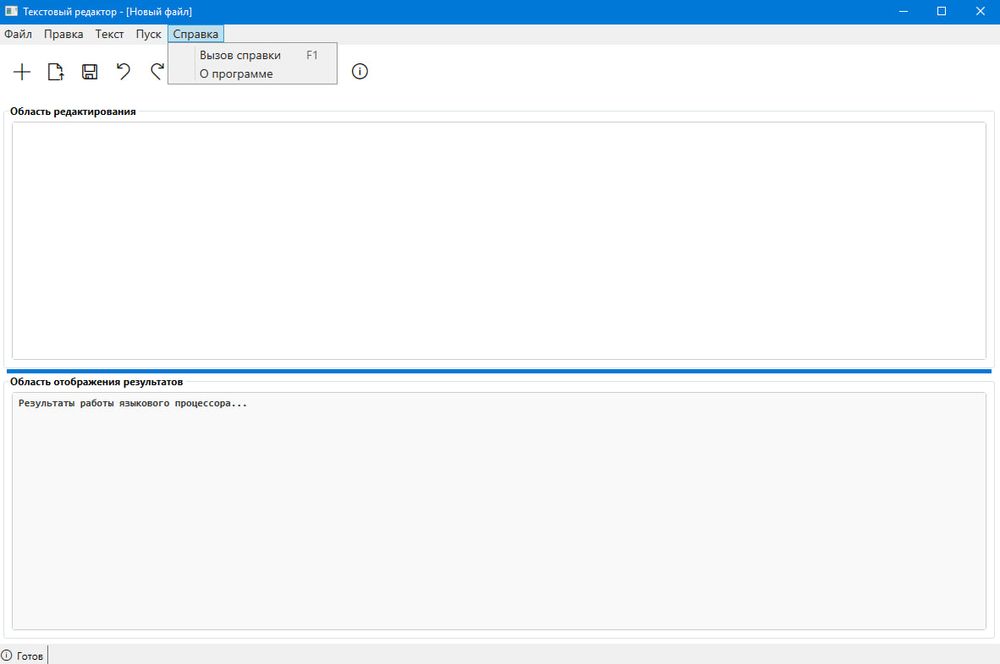
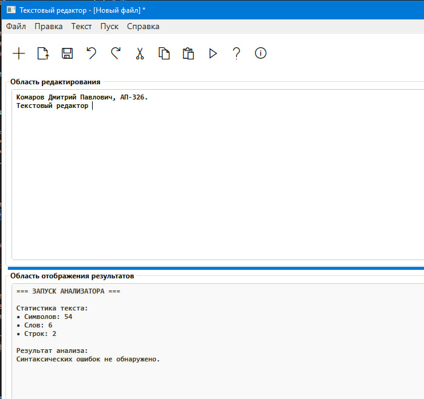

# Текстовый редактор — Языковой процессор

**Автор:** Комаров Дмитрий Павлович  
**Группа:** АП-326  
**Дисциплина:** Теория формальных языков и компиляторов  
**Год:** 2026  

---

## Описание проекта

Реализован полнофункциональный текстовый редактор с графическим интерфейсом, 
поддерживающий базовые операции редактирования текста, работу с файлами 
и область вывода результатов синтаксического анализа.

Приложение разработано в соответствии с требованиями лабораторной работы 
и подготовлено для дальнейшего расширения функциональности языкового процессора.

---

## Основные возможности

- Создание, открытие и сохранение файлов (TXT, RTF)
- Полный набор операций редактирования текста
- Панель инструментов для быстрого доступа к функциям
- Разделённые области редактирования и вывода результатов
- Строка состояния с отображением позиции курсора
- Информационные разделы (грамматика, метод анализа и др.)
- Имитация работы синтаксического анализатора

---

## Интерфейс приложения

### Главное окно

  

---

### Меню «Файл»

  

---

### Меню «Правка»

  

---

### Меню «Текст»

  

---

### Меню «Пуск»

  

---

### Меню «Справка»

  

---

### Пример результата анализа

  

---

## Используемые технологии

| Компонент | Технология |
|-----------|------------|
| Язык программирования | C# |
| Платформа | .NET 8.0 |
| Фреймворк GUI | WPF |
| Среда разработки | Visual Studio 2022 |

---

## Заключение

Разработанное приложение соответствует требованиям дисциплины 
и может служить основой для дальнейшей реализации полноценного 
синтаксического анализатора и расширения функционала языкового процессора.

---

© 2026 Комаров Дмитрий Павлович, АП-326
