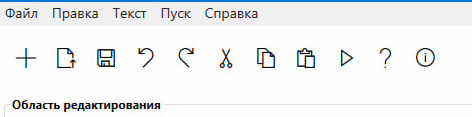

# Текстовый редактор с функциями языкового процессора

---

## Название и цель лабораторной работы

**Название:**  
Разработка текстового редактора с графическим интерфейсом

**Цель работы:**  
Разработать приложение — текстовый редактор, который в дальнейшем будет дополнен функциями языкового процессора. Приложение должно иметь графический интерфейс пользователя с возможностью редактирования текста, сохранения/загрузки файлов и вывода результатов работы анализатора.

---

## Сведения об авторе

**Автор:** Комаров Дмитрий Павлович  
**Группа:** АП-326  
**Дисциплина:** Теория формальных языков и компиляторов  
**Год:** 2026  

---

## Описание проекта

Реализован полнофункциональный текстовый редактор с графическим интерфейсом, поддерживающий базовые операции редактирования текста, работу с файлами и имеющий отдельную область вывода результатов работы синтаксического анализатора.

Приложение разработано в соответствии с требованиями лабораторной работы и подготовлено для дальнейшего расширения функционала языкового процессора.

---

## Основные возможности

- Создание, открытие и сохранение текстовых файлов (TXT, RTF)
- Полный набор операций редактирования:
  - Отмена / повтор действий
  - Вырезание, копирование и вставка
  - Удаление выделенного фрагмента текста
  - Выделение всего текста
- Панель инструментов с иконками для быстрого доступа к основным функциям
- Разделённые области редактирования и вывода результатов с возможностью изменения их размеров
- Строка состояния с отображением статуса и информации о текущем файле
- Информационные окна с описанием грамматики, метода анализа, постановки задачи и других теоретических разделов
- Имитация работы синтаксического анализатора с выводом результатов в нижнюю область
- Контекстная справка и окно «О программе»

---

## Используемые технологии

| Компонент | Технология |
|-----------|------------|
| Язык программирования | C# |
| Платформа | .NET 8.0 |
| GUI-фреймворк | WPF (Windows Presentation Foundation) |
| Среда разработки | Microsoft Visual Studio 2022 |
| Иконки | Segoe MDL2 Assets (системные иконки Windows) |
| Форматы файлов | TXT, RTF |

---

## Инструкция по сборке и запуску

### Требования к системе
- Windows 10 / 11
- Установленный **.NET 8.0 Runtime** (или **SDK** для разработки)
- Не менее 100 МБ свободного места

### Установка зависимостей
Дополнительные зависимости не требуются.

### Запуск через Visual Studio (рекомендуется)
1. Откройте файл решения `.sln` (или проект) в Visual Studio 2022
2. Проверьте, что выбрана конфигурация **Debug/Release**
3. Нажмите **F5** (Запуск) или **Ctrl+F5** (Запуск без отладки)

### Запуск без установленной IDE
1. Перейдите в папку сборки проекта, например:  
   `bin/Release/net8.0-windows/` или `bin/Debug/net8.0-windows/`
2. Запустите файл приложения **.exe**
3. Приложение готово к работе

---

# Описание интерфейса и функций (руководство пользователя)

---

## Главное окно приложения

  

**Основные элементы интерфейса:**
1. **Заголовок окна** — отображает название приложения «Текстовый редактор — Языковой процессор»
2. **Главное меню** — содержит все команды программы, сгруппированные по разделам
3. **Панель инструментов** — кнопки быстрого доступа к часто используемым функциям
4. **Область редактирования** — основная рабочая область для ввода и редактирования текста
5. **Область вывода результатов** — отображение результатов работы анализатора (только для чтения)
6. **Разделитель** — позволяет изменять соотношение размеров областей
7. **Строка состояния** — отображает текущий статус и информацию о работе

---

## Главное меню

### Меню «Файл»

  

| Пункт меню | Горячая клавиша | Описание |
|------------|-----------------|----------|
| Создать | Ctrl+N | Создание нового пустого документа |
| Открыть | Ctrl+O | Открытие существующего файла (TXT, RTF) |
| Сохранить | Ctrl+S | Сохранение текущего документа |
| Сохранить как | Ctrl+Shift+S | Сохранение документа под новым именем |
| Выход | Alt+F4 | Выход из программы с предложением сохранить изменения |

---

### Меню «Правка»

  

| Пункт меню | Горячая клавиша | Описание |
|------------|-----------------|----------|
| Отменить | Ctrl+Z | Отмена последнего действия |
| Повторить | Ctrl+Y | Повтор отменённого действия |
| Вырезать | Ctrl+X | Вырезать выделенный фрагмент в буфер обмена |
| Копировать | Ctrl+C | Копировать выделенный фрагмент в буфер обмена |
| Вставить | Ctrl+V | Вставить текст из буфера обмена |
| Удалить | Del | Удалить выделенный фрагмент |
| Выделить всё | Ctrl+A | Выделить весь текст в документе |

---

### Меню «Текст»

  

Раздел содержит теоретическую информацию:
- **Постановка задачи** — цели разработки языкового процессора
- **Грамматика** — формальное описание грамматики
- **Классификация грамматики** — тип грамматики по Хомскому
- **Метод анализа** — описание алгоритма разбора
- **Тестовый пример** — пример работы анализатора
- **Список литературы** — перечень использованных источников
- **Исходный код программы** — описание структуры проекта

---

### Меню «Пуск»

  

| Пункт меню | Горячая клавиша | Описание |
|------------|-----------------|----------|
| Запуск анализатора | F5 | Запуск синтаксического анализатора. Результаты выводятся в нижнюю область |

---

### Меню «Справка»

  

| Пункт меню | Горячая клавиша | Описание |
|------------|-----------------|----------|
| Вызов справки | F1 | Открытие руководства пользователя |
| О программе | — | Информация о программе и авторе |

---

## Панель инструментов

  

Панель инструментов предназначена для быстрого доступа к основным функциям программы:
- Создание, открытие, сохранение документов
- Отмена/повтор действий
- Вырезать/копировать/вставить
- Запуск анализатора
- Справка и информация о программе

---

## Область редактирования

Область редактирования предназначена для ввода и редактирования текста:
- многострочный ввод
- полосы прокрутки при большом объёме
- поддержка работы с текстом в файлах TXT/RTF

---

## Область вывода результатов

  

Нижняя область предназначена для вывода результатов анализа:
- только чтение
- отображение результатов проверки
- вывод статистики и сообщений анализатора

---

## Пример работы анализатора

1. Введите текст в области редактирования (например, тестовую строку).
2. Нажмите **«Пуск»** или клавишу **F5**.
3. Результат отобразится в области вывода.

---

## Ограничения и особенности реализации

### Известные ограничения текущей версии
1. **Синтаксический анализатор** — в текущей версии реализована имитация работы анализатора. Полноценный анализатор будет реализован на следующих этапах.
2. **Подсветка синтаксиса** — функция подсветки ключевых слов находится в разработке.
3. **Многооконный режим** — вкладки не реализованы, работа с файлами выполняется последовательно.
4. **Форматы файлов** — поддерживаются TXT и RTF, остальные форматы открываются как обычный текст.
5. **Размер файлов** — при работе с очень большими файлами возможны задержки.

### Особенности реализации
- Используются системные иконки Windows (Segoe MDL2 Assets)
- Запрос на сохранение изменений при закрытии/создании нового файла
- Разделитель позволяет менять размер областей редактирования и вывода
- Динамическое обновление статуса и информации

---

## Заключение

Разработанное приложение соответствует требованиям лабораторной работы:
- ✅ графический интерфейс пользователя
- ✅ реализованы меню «Файл», «Правка», «Текст», «Пуск», «Справка»
- ✅ панель инструментов
- ✅ область редактирования и область вывода результатов
- ✅ изменение размеров областей
- ✅ запрос на сохранение изменений
- ✅ информационные окна

Приложение готово к дальнейшему расширению функционала языкового процессора.

---

© 2026 Комаров Дмитрий Павлович, АП-326
